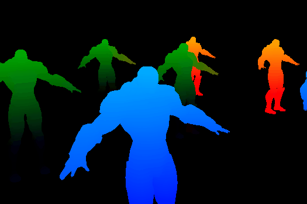

# Deferred-Rendering

# PBR-Renderer

Break down rendering into base pass and lighting pass in 

## Screenshots


## Features
- Deferred Rendering
  - Geometry pass
      - Instanced drawing
      - G buffer
        - Position attachment
        - Normal attachment
        - Albero attachment (diffuse + specular)
  
  - Lighting pass
     - Blinn-Phong model
     - Point lights
    
## Build

### Windows
```
git clone --recursive https://github.com/lanwenzhang/Deferred-Rendering.git
cd Deferred-Rendering
mkdir build
cd build
cmake -G "Visual Studio 17 2022" -A x64 ..
```

## Dependencies
* [glfw](https://github.com/glfw/glfw)
* [glad](https://glad.dav1d.de/)
* [imgui](https://github.com/ocornut/imgui)
* [stb](https://github.com/nothings/stb)
* [assimp](https://github.com/assimp/assimp)

## Reference
* [Learn OpenGL Tutorial](https://learnopengl.com)
* [OGLDEV OpenGL Tutorial](https://ogldev.org)
* [GAMES 202, Advanced Real-time Rendering](https://sites.cs.ucsb.edu/~lingqi/teaching/games202.html)
